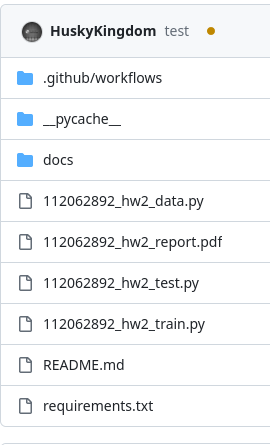

<br />
<div align="center" id="readme-top">
  
  <h1 align="center">Leaderboard Submission Guide</h1>
  <h3 align="center">Deep Reinforcement Learning Class 2024 Programming Homework 2 | National Tsing Hua University</h3>

Due: 2022/04/09 (Tue.) 23:59

  <p align="center" >


Leaderboard Link: [http://project.aseart.com/s/FOB2023/deep](http://project.aseart.com/s/FOB2023/deep)

</div>


## Important Remainders

- DO NOT CHANGE anything in eval.py or git action, otherwise you will result in 0 score in leaderboard section.

- Make sure set your repo to private after fork.

- Make sure to allow CPU mode in your test agent.

- Make sure you pass checker.py checking before submitting to leaderboard.


## Leaderboard Submission

We provide a leaderboard for you to compare with your classmate, the ranking of which will be a significant reference of your overall score based on your relative ranking position.  

To submit your code to leaderboard, you will need to first **fork this repo**.

Then clone it to your local environment:

```
git clone <Your forked repo> 
```

Now replace `112062892_hw2_test.py` and `112062892_hw2_data.py` in the repo with your own version of them. The following packages were installed by default in repo cloud environment:

- Python 3.7
- tdqm
- requests
- flappy-bird-gym 
- torch (CPU)

If you wish to add more dependencies inorder to run your code, please add them into `requirements.txt`, each raw for one dependency.

The change the name in `meta.xml` to your **STUDENT ID** for the submission. Note that if you submit to leaderboard multiple times when you improved the agent, simply use the same name and the result will be updated.

```
<?xml version="1.0"?>
<catalog>
   <info>
      <name>CHANGE HERE INTO YOUR ID</name> 
   </info>
</catalog>
```

Once you are happy with above, commit & push them to your forked repo:

```
git commit -m "submission"
git push
```

Pushing to the repo will trigger the following procedure:

1. Creating virtual env
2. installing dependencies
3. Check your submission
4. Run your code and return a score if checking succeed and Push the socre to the leaderboard


This might need some time since the leaderboard are running on CPU, you could check the progress of it by clicking the orange dot showing in below [Top left near "submission" in the pic.] then in the pop-up window clike "details", if the any of above workflow fails, you could view details in it.




